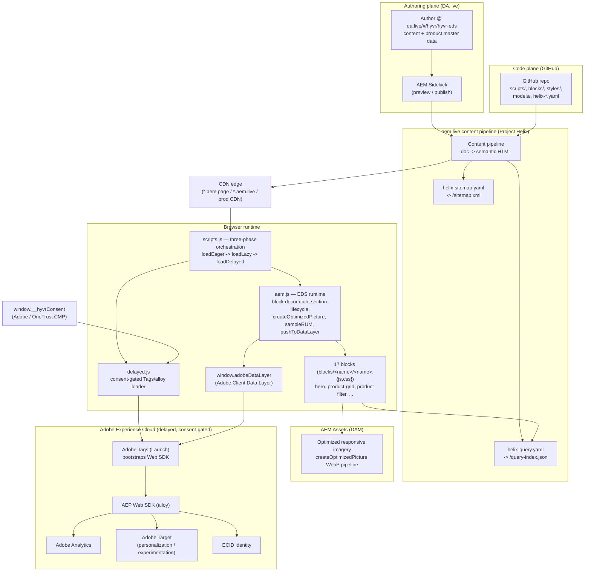
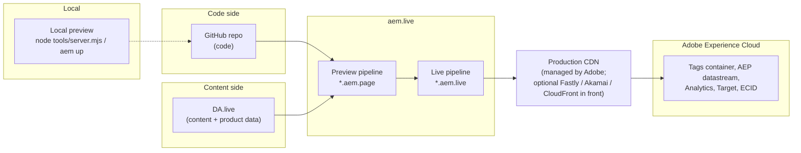
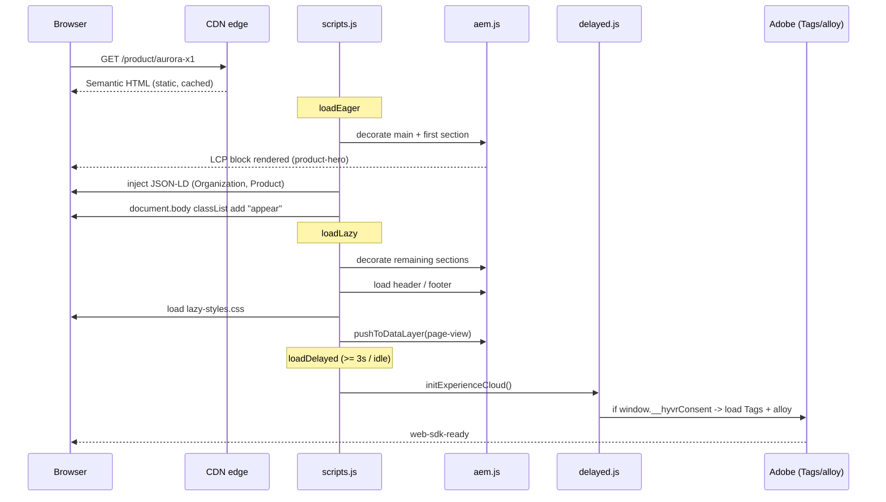
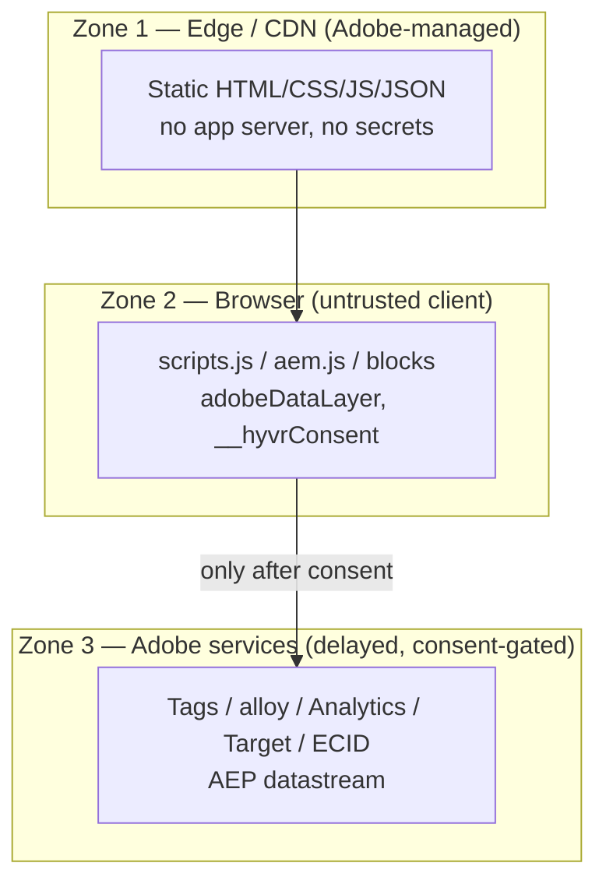
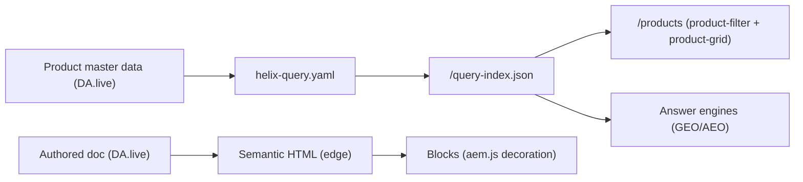

# HYVR — Blueprint 1 Architecture

**Blueprint:** AEM Edge Delivery Services (EDS) + DA.live
**Brand:** HYVR (pronounced "HIGH-ver") — a fictional D2C marketplace for AR / VR / gaming hardware and experiences.
**Repo:** `blueprint-1-eds-dalive`

---

## 1. Overview & Principles

HYVR is built on **Adobe Experience Manager Edge Delivery Services** (aem.live / Project Helix) with **document-based authoring in DA.live**. The architecture is deliberately *static-first, edge-rendered, and progressively enhanced* so that the render path has no application server, no client framework, and no single point of failure.

Guiding principles:

1. **Content and code are decoupled.** Code lives in GitHub; content and product master data live in DA.live. The two are joined only at the edge by the aem.live content pipeline.
2. **The edge renders semantic HTML.** Authored documents are transformed into clean, semantic HTML at the CDN edge. The browser receives markup, not a JSON bundle to hydrate.
3. **Performance is a hard budget, not an aspiration.** The target is **100/100 Lighthouse**. Everything that is not required for the Largest Contentful Paint (LCP) is deferred.
4. **Martech never touches Core Web Vitals.** All data collection and personalization tooling loads in the **delayed phase**, consent-gated, after the page is interactive.
5. **Blocks are vanilla ES modules.** No build-time framework. Each block is decorated lazily by name.
6. **Privacy and consent are first-class.** No analytics, identity, or personalization request fires before consent is resolved.
7. **Machine-readable by design.** `/query-index.json`, JSON-LD, `sitemap.xml`, and an explicit answer-engine allowlist make the site consumable by both browsers and AI answer engines (GEO / AEO).

---

## 2. Logical View

### 2.1 Component diagram

### 2.2 Component responsibilities

| Component | Plane | Responsibility |
|---|---|---|
| **DA.live** | Authoring | Document-based authoring at `da.live/#/hyvr/hyvr-eds`. Authors edit page content and product master data as documents. |
| **AEM Sidekick** | Authoring | Author-facing toolbar for preview and publish; triggers the pipeline. |
| **GitHub repo** | Code | Source of truth for `scripts/`, `blocks/`, `styles/`, `models/`, `helix-query.yaml`, `helix-sitemap.yaml`, `robots.txt`, `head.html`. |
| **aem.live pipeline** | Edge | Renders authored docs to semantic HTML; joins code + content; generates `/query-index.json` and `/sitemap.xml`. |
| **CDN edge** | Edge | Serves static HTML/CSS/JS/JSON at `*.aem.page` (preview), `*.aem.live` (live), and the production CDN. |
| **`aem.js`** | Browser | EDS runtime: block decoration, section lifecycle (`initialized → loading → loaded`), `createOptimizedPicture`, `sampleRUM`, `pushToDataLayer`. |
| **`scripts.js`** | Browser | Three-phase orchestration: `loadEager`, `loadLazy`, `loadDelayed`. |
| **`delayed.js`** | Browser | Consent-gated loader for Adobe Tags + alloy in the delayed phase. |
| **Blocks (17)** | Browser | Vanilla ES modules, lazy-loaded by name; own their DOM decoration + styling. |
| **AEM Assets** | DAM | Delivers optimized, responsive WebP imagery through the `createOptimizedPicture` pipeline. |
| **`window.adobeDataLayer`** | Browser | Adobe Client Data Layer; event bus consumed by Tags and mapped to XDM. |
| **`window.__hyvrConsent`** | Browser | Consent state from the Adobe / OneTrust CMP; gates all martech. |
| **Adobe Tags (Launch)** | Adobe | Bootstraps the Web SDK; maps data-layer events to XDM. |
| **AEP Web SDK (alloy)** | Adobe | Single edge transport to Adobe Experience Platform / Analytics / Target / ECID. |
| **Adobe Analytics / Target / ECID** | Adobe | Measurement, personalization/experimentation, and identity resolution respectively. |

---

## 3. Deployment View

Two independent flows converge at the pipeline: a **code-side flow** (GitHub) and a **content-side flow** (DA.live). Neither blocks the other.

**Code-side change:** developer edits `scripts/`, `blocks/`, or config, tests via `node tools/server.mjs` / `aem up` locally, pushes to GitHub. The pipeline picks up the code; authors validate on preview (`*.aem.page`) before publish.

**Content-side change:** author edits a document or product record in DA.live, uses **AEM Sidekick → Preview** to render it to `*.aem.page`, reviews, then **Publish** promotes it to `*.aem.live` and the production CDN.

Live provisioning is required to make this real:
- **G-BP1-1** — real DA.live org + aem.live pipeline provisioning.
- **G-BP1-2** — AEM Assets DAM tenant.
- **G-BP1-3** — Adobe Tags container + AEP datastream IDs (consumed by the delayed phase).

---

## 4. Runtime / Request Flow

**Why this yields good Core Web Vitals:**
- **LCP** — the first section (typically `hero` / `product-hero`) and its optimized WebP image are decorated in the eager phase; nothing else competes for the main thread first.
- **CLS** — sections stay hidden until decorated (`initialized → loading → loaded`) and are revealed via the `appear` class, so blocks do not shift as they hydrate. `createOptimizedPicture` sets intrinsic dimensions.
- **INP / TBT** — no framework hydration; martech is pushed entirely into the delayed phase (after ~3s / idle), so Tags, alloy, Analytics and Target never contend with first interaction.

---

## 5. The Three-Phase Loading Model

`scripts.js` orchestrates three strictly ordered phases. This is the core performance contract.

| Phase | Function | What it does | Why |
|---|---|---|---|
| **Eager** | `loadEager` | Decorate `main`; decorate and load the **first section** (LCP); inject JSON-LD (`Organization`, `Product`); add `appear`. | Everything needed to paint the LCP and be structurally correct, and nothing else. |
| **Lazy** | `loadLazy` | Decorate remaining sections; load `header` / `footer`; load `lazy-styles.css`; emit `page-view` to the data layer. | Complete the page for interaction without blocking first paint. |
| **Delayed** | `loadDelayed` | `initExperienceCloud()` → load Adobe Tags + alloy after ~3s, **consent-gated** via `delayed.js`. | Keep all data collection / personalization off the critical path so CWV is unaffected. |

The delayed phase is where `delayed.js` reads `window.__hyvrConsent` and, only if consent is granted, bootstraps Adobe Tags (which in turn bootstraps the Web SDK). If consent is not granted, martech simply never loads.

---

## 6. Block Architecture & the Federated Artefact Model

### 6.1 Blocks and sections

An authored document is a sequence of **sections** (separated by `---`), each containing **blocks** (tables whose first cell names the block). `aem.js` decorates sections through the lifecycle `initialized → loading → loaded`, and lazy-loads each block by name from `blocks/<name>/<name>.{js,css}`.

The 17 blocks:

`header`, `footer`, `hero`, `product-card`, `product-grid`, `product-filter`, `product-hero`, `product-specs`, `product-gallery`, `comparison`, `community-cta`, `breadcrumb`, `drop-badge`, `stats`, `quote`, `cards`, `columns`, `fragment`.

- **Auto-blocking** — `scripts.js` synthesizes blocks (e.g. a `product-hero` on PDPs) from page structure/metadata without the author explicitly inserting a table.
- **Fragments** — the `fragment` block is HYVR's experience-fragment equivalent: it transcludes another authored document, enabling shared/reusable content composition.
- **Metadata** — page-level metadata (in a `metadata` table / doc front matter) drives JSON-LD, titles, and `helix-query.yaml` indexing.

### 6.2 Federated artefact model (governance)

Authoring surfaces (Universal Editor / DA blocks) are governed by three model artefacts under `models/`:

| Artefact | Role |
|---|---|
| `component-definition.json` | Declares available components/blocks and how they are inserted. |
| `component-models.json` | Declares each component's editable fields (the data schema authors edit). |
| `component-filters.json` | Declares which components are allowed in which containers (composition rules). |

### 6.3 Design tokens

Blocks consume design tokens from the shared **`../../design-system`** package (CSS custom properties for color, type, spacing). Blocks must style against tokens rather than hard-coded values so HYVR stays visually consistent with the wider system.

---

## 7. Security Boundaries (Trust Zones)

- **Zone 1 (Edge/CDN):** serves immutable static artefacts. There is no origin application server in the render path and no secret material shipped to the edge for rendering.
- **Zone 2 (Browser):** all runtime code executes here and is therefore fully untrusted. It holds no long-lived secrets. Datastream/org IDs used by alloy are public client identifiers, injected via Tags data elements (**G-BP1-3**), not credentials.
- **Zone 3 (Adobe services):** reached only from the delayed phase, and only after `window.__hyvrConsent` grants the relevant category. The CMP boundary between Zone 2 and Zone 3 is the enforcement point for privacy.

Trust flows one way: edge → browser → (consent gate) → Adobe. Content authored in DA.live is treated as data and never executed as code.

---

## 8. Data & Content Flows

Two distinct flows:

**Authored doc → HTML.** An author writes a document in DA.live. On preview/publish the pipeline renders it to semantic HTML, which the CDN serves and `aem.js` decorates into blocks.

**Product data → query-index → blocks & AI.** Product master data authored in DA.live is indexed by `helix-query.yaml` into `/query-index.json` — a machine-consumable feed. The PLP (`/products`) reads it directly to build the faceted `product-filter` + `product-grid` experience (fired via the `hyvr:filter` CustomEvent). The same index, plus JSON-LD, is what answer engines consume.

---

## 9. Scaling & Resilience

- **Edge caching / static-first.** Every response is a cacheable static artefact served from CDN, so scale is a CDN concern, not an application concern. An optional customer CDN (Fastly / Akamai / CloudFront) can sit in front of the Adobe-managed production CDN.
- **No SPOF in the render path.** There is no application server or database on the critical path; a page renders from static HTML + edge-cached JSON.
- **Graceful block failure isolation.** `loadBlock` decorates each block inside a `try/catch`, so a single failing block does not break the page — the rest of the document still renders and remains interactive.
- **Martech is non-blocking.** If Adobe services or the CMP are slow or unavailable, the delayed phase simply does not complete; the core experience is unaffected because nothing in Zones 1–2 depends on Zone 3.

---

## 10. Extensibility & Future Evolution

- **New blocks** drop into `blocks/<name>/` and are registered in the federated artefact model (`component-definition` / `component-models` / `component-filters`) — no core changes required.
- **Commerce.** The cart / checkout backend is not yet wired (**G-BP1-4**); `add-to-cart` currently emits a data-layer event only. A future Adobe Commerce or headless-commerce integration would consume that event and provide fulfilment.
- **Personalization** expands through Adobe Target activities against the existing delayed-phase alloy transport — no render-path change.
- **Testing.** Playwright E2E coverage is planned but not vendored (**G-BP1-5**).
- **Live provisioning** required for production: **G-BP1-1** (DA.live org + aem.live pipeline), **G-BP1-2** (AEM Assets tenant), **G-BP1-3** (Tags container + AEP datastream IDs).
