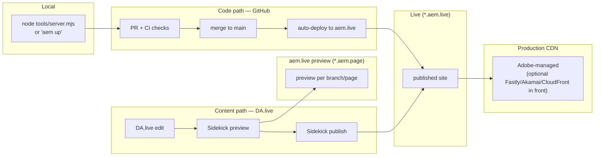

# HYVR — CI/CD & Environments (Blueprint 1: AEM EDS + DA.live)

> Scope: how HYVR ("HIGH-ver") code and content flow from local to production, the quality gates that guard
> them, and how the same gates run on non-GitHub CI (portability, Req 8).
> Referenced gaps: **G-BP1-1** (DA.live/aem.live provisioning), **G-BP1-3** (Tags/AEP datastream IDs),
> **G-BP1-5** (Playwright not vendored).

---

## 1. Environments & promotion

EDS separates the **code path** (GitHub → aem.live) from the **content path** (DA.live → Sidekick → publish).
Both converge at the edge.



**Env chain:** local (`node tools/server.mjs` or `aem up`) → aem.live **preview** (`*.aem.page`) →
**live** (`*.aem.live`) → **production CDN** (Adobe-managed; optional Fastly/Akamai/CloudFront in front).

- **Code path:** open PR → CI gates pass → merge to `main` → aem.live auto-deploys the code.
- **Content path:** authors edit in DA.live → preview via Sidekick (`*.aem.page`) → publish to live. Content
  ships independently of code deploys.

---

## 2. Branching & release strategy

- **Trunk-based**: `main` is always releasable and protected.
- **Short-lived feature branches**, one logical change each, merged via PR and deleted after merge.
- **Preview-per-branch**: every branch is previewable at its own `*.aem.page` URL for review before merge.
- **No long-running release branches**; releases are merges to `main` that auto-deploy. Tag notable releases
  for traceability.

---

## 3. CI gates

From `.github/workflows/ci.yaml` — two jobs: `build-and-test` then `quality-gates`.

| Gate | Command (from ci.yaml) | Pass criteria |
|---|---|---|
| Token-drift governance | `node ../design-system/scripts/build-tokens.mjs --out styles` then `git diff --exit-code styles/tokens.css` | `tokens.css` regenerated from `../../design-system` matches committed file (no drift) |
| ESLint | `npm run lint:js` | No JS lint errors |
| Stylelint | `npm run lint:css` | No CSS lint errors |
| Node unit tests | `npm test` | All unit tests pass |
| Lighthouse CI | `npx @lhci/cli autorun` on `/`, `/products`, `/product/aurora-x1` | Meets `lighthouse:recommended` budgets (perf/SEO/a11y/best-practices) |
| pa11y-ci (WCAG 2.2 AA) | `npx pa11y-ci` on `/`, `/products`, `/product/aurora-x1` | No WCAG 2.2 AA violations |

> Current `ci.yaml` runs Lighthouse and pa11y with a trailing `|| true` (reporting mode). **Definition of Done
> for hardening:** remove `|| true` so these gates block merge once budgets are stabilized.

Governance gates are branch-protection **required checks** on `main` (see `docs/security-privacy.md` §5.2).

---

## 4. Portability (Req 8 — no lock-in)

The same steps run unchanged on other CI systems; only the YAML wrapper differs.

**GitLab CI (`.gitlab-ci.yml`)**
```yaml
stages: [build, quality]
default:
  image: node:22
build-and-test:
  stage: build
  script:
    - npm ci
    - node ../design-system/scripts/build-tokens.mjs --out styles
    - git diff --exit-code styles/tokens.css
    - npm run lint:js
    - npm run lint:css
    - npm test
quality-gates:
  stage: quality
  needs: [build-and-test]
  script:
    - npm ci
    - node tools/server.mjs & npx wait-on http://localhost:3001
    - npx @lhci/cli autorun --collect.url=http://localhost:3001 --collect.url=http://localhost:3001/products
    - npx pa11y-ci http://localhost:3001 http://localhost:3001/products
```

**Azure DevOps (`azure-pipelines.yml`)**
```yaml
trigger: [main]
pool: { vmImage: ubuntu-latest }
steps:
  - task: NodeTool@0
    inputs: { versionSpec: '22.x' }
  - script: npm ci
  - script: node ../design-system/scripts/build-tokens.mjs --out styles && git diff --exit-code styles/tokens.css
    displayName: Token-drift gate
  - script: npm run lint:js && npm run lint:css && npm test
    displayName: Lint + unit tests
  - script: node tools/server.mjs & npx wait-on http://localhost:3001
    displayName: Start preview
  - script: npx @lhci/cli autorun --collect.url=http://localhost:3001 && npx pa11y-ci http://localhost:3001
    displayName: Lighthouse + pa11y
```

The gates depend only on Node + npm scripts, so no GitHub-specific capability is required.

---

## 5. Rollback

- **Code rollback:** `git revert <sha>` (or revert the merge) → push to `main` → aem.live auto-redeploys the
  previous good state. Prefer revert over force-push to keep history and branch protection intact.
- **Content rollback:** restore the prior **DA.live version** and re-publish via **Sidekick**; use Sidekick
  **unpublish/republish** to pull a bad page and push the corrected version. Content rollback needs no code deploy.

---

## 6. Secrets & config per environment

- App code carries **no secrets**; runtime martech identifiers are injected via page **metadata / env config**
  rather than hard-coded (datastream IDs, Tags library URL) — pending real values under **G-BP1-3**.
- CI secrets (deploy token, LHCI token, any API keys) live in the CI secret store, scoped per environment and
  masked in logs. Least-privilege deploy token per `docs/security-privacy.md` §5.2.

| Config | local | preview | live/prod | Source |
|---|---|---|---|---|
| Tags (Launch) library URL | dev/none | staging library | prod library | page metadata / env (G-BP1-3) |
| AEP datastream ID | dev | staging | prod | env config (G-BP1-3) |
| Deploy token | n/a | scoped | scoped | CI secret store |
| CDN config (optional Fastly/Akamai/CloudFront) | n/a | n/a | edge config | Ops-managed |

---

## 7. Definition of Done + release checklist

**Definition of Done (release)**
- Change is traceable to a requirement/ticket.
- All CI gates green: token-drift, ESLint, Stylelint, unit tests, Lighthouse budgets, pa11y WCAG 2.2 AA
  (blocking mode where enabled — see §3).
- No token drift; design tokens sourced only from `../../design-system`.
- No new high/critical `npm audit` findings.
- Docs updated where behavior changed; affected gaps noted.
- Preview reviewed on `*.aem.page`; content authors signed off where content is involved.

**Release checklist**
1. PR reviewed + approved; branch protection satisfied.
2. CI green; preview URL validated (home / PLP / PDP).
3. Merge to `main`; confirm aem.live auto-deploy succeeded.
4. Smoke-check live URLs + RUM (see `docs/observability.md`).
5. Tag release; note any follow-ups / owned gaps.
6. Rollback path confirmed (last good SHA / DA.live version identified).
