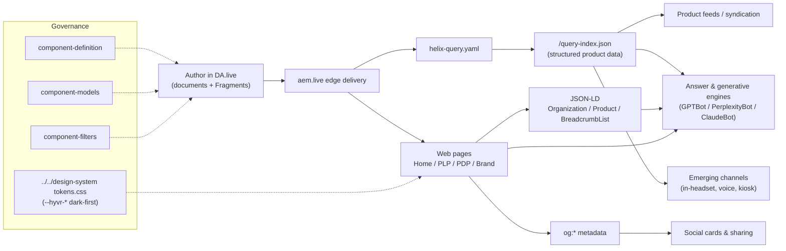

# HYVR Content Model — Channel-Neutral Content Strategy

**Blueprint 1 — AEM Edge Delivery Services (EDS) + DA.live**
Covers Req 2 (federated artefact model), Req 3 (channel-neutral content strategy), and Req 4 (AI-discoverability).

HYVR (pronounced "HIGH-ver") is a fictional D2C AR/VR/gaming marketplace. Content is authored as documents in **DA.live**, delivered over the **aem.live** edge, and consumed by web pages, social surfaces, and machine/agent readers from a single structured source of truth.

---

## 1. Principles

1. **Structured before styled.** Every piece of content is captured as typed, named fields — never as pre-formatted HTML. Presentation is applied at delivery time by blocks and governed design tokens.
2. **Channel-neutral.** Content carries meaning, not layout. The same product record renders a PDP, a social card, a query-index row, and a JSON-LD graph without re-authoring.
3. **Reuse over duplication.** Shared assertions (promos, legal, CTAs) live once as Fragments and are referenced everywhere. Product master data lives once in the product documents and is projected into `/query-index.json`.
4. **Machine-readable by default.** Clean semantic HTML plus explicit metadata plus JSON-LD makes content equally legible to browsers, crawlers, and answer/generative engines (see §5, §7).
5. **Governed presentation.** Colour, type, and spacing come exclusively from `../../design-system` tokens (`tokens.css`, `--hyvr-*` custom properties, dark-first). Authors never choose hex values.

---

## 2. Content Types & Taxonomy

| Content type | Route / location | Purpose | Primary blocks |
|---|---|---|---|
| **Brand page** | `/about` | Brand story, values, org facts | hero, columns, stats, cards, quote, community-cta |
| **PLP** (Product Listing) | `/products` | Faceted filter + grid over the product index | product-filter, product-grid, product-card |
| **PDP** (Product Detail) | `/product/{slug}` | Single-product detail, specs, gallery, comparison | product-hero, product-specs, product-gallery, comparison, breadcrumb |
| **Editorial / Story** | `/stories/*` (extensible) | Long-form narrative, launches, guides | hero, columns, cards, quote |
| **Drop** | `/drops/*` (extensible) | Time-boxed release / campaign | drop-badge, hero, product-grid, community-cta |
| **Fragment** (shared) | `/fragments/*` | Reusable content included into pages | fragment (+ any block) |
| **Product master data** | `/product/**` → `/query-index.json` | Structured, machine-consumable product records | consumed by product-grid, product-filter, comparison, and AI engines |

**Taxonomy dimensions** (authored as product metadata, faceted on the PLP): `category`, `platform`, `brand`, `availability`, `tags`. These are the controlled vocabularies that drive filtering, related-content logic, and social/agent categorisation.

### Product content model

The Product model is the canonical structured record. Fields map 1:1 to the `/query-index.json` columns (generated by `helix-query.yaml` from `og:*`/`meta` on each `/product/**` page).

| Field | Type | Required | Notes |
|---|---|---|---|
| `path` | string (URL path) | Yes | Stable identity / canonical route, e.g. `/product/aurora-x1`. Must be unique. |
| `title` | string | Yes | Product name; sourced from `og:title`. |
| `image` | string (URL) | Yes | Primary image; sourced from `og:image`. |
| `category` | enum (taxonomy) | Yes | e.g. `VR/MR Headsets`, `AR Glasses`, `Controllers`, `Handheld Gaming`. Drives PLP facet. |
| `platform` | enum (taxonomy) | Yes | e.g. `Standalone`, `Tethered`, `PC`, `Handheld`, `Universal`. |
| `brand` | string (taxonomy) | Yes | Marketplace vendor/brand, e.g. `Auroracorp`, `HYVR Labs`. |
| `price` | string (numeric) | Yes | Numeric string, no symbol, e.g. `1299`. Machine-parseable for schema.org `offers.price`. |
| `currency` | string (ISO 4217) | Yes | e.g. `USD`. Pairs with `price` for offers. |
| `availability` | enum (schema.org) | Yes | schema.org state: `InStock`, `PreOrder`, `OutOfStock`, etc. Validated by unit tests. |
| `rating` | string (numeric) | No | Aggregate rating 0–5, e.g. `4.8`. |
| `fov` | string (numeric) | No | Field of view in degrees; blank for non-optical products. |
| `refresh` | string (numeric) | No | Refresh/polling rate in Hz; blank where N/A. |
| `resolution` | string | No | Per-eye or panel resolution, e.g. `4K per eye`. |
| `tags` | string (CSV) | No | Comma-separated free/controlled tags, e.g. `mixed-reality,passthrough,flagship`. Powers related content and agent facets. |
| `summary` | string | Yes | One-sentence description; sourced from `meta[name="description"]`. Used for cards, social, and answer snippets. |

> Optional fields left blank (e.g. `fov` on a controller) are intentional — the model is a superset across product categories.

---

## 3. DA.live Authoring Model

Authors write **documents** in DA.live. Each document maps to a page; **section breaks** map to page sections; **tables named after a block** map to blocks; and paragraph/heading structure maps to block content.

- **Document → page.** The document path becomes the delivery path (`/products`, `/product/aurora-x1`, `/about`).
- **Table → block.** A table whose first cell names a block (e.g. `product-grid`, `comparison`) is decorated by the matching JS/CSS in `/blocks/{name}`.
- **Auto-blocking.** Scripts synthesise blocks from plain content where a table would be redundant — e.g. a leading image + heading becomes a `hero`, and product pages auto-assemble `product-hero`/`product-specs` from metadata + content. This keeps documents clean and channel-neutral.
- **Metadata table.** A `Metadata` block (key/value table) carries page metadata (§5) and the `template` selector.
- **Governance via models** (root `component-*.json`, built from federated `blocks/*/_*.json`): authoring is constrained by three artefacts consumed by **Universal Editor** (the AEMaaCS crosswalk surface). DA.live gets its palette from the Sidekick block Library instead (`tools/sidekick/library.json`). Both surfaces are instrumented:
  - `component-definition.json` — which blocks may be inserted.
  - `component-models.json` — the fields each block exposes to authors (types, labels).
  - `component-filters.json` — which blocks are allowed in which containers/sections.

This trio is the contract between authors and code: it prevents unstructured or off-brand authoring while keeping the document experience simple.

---

## 4. Fragments — Experience / Content-Fragment Equivalents

The `fragment` block is HYVR's cross-surface reuse primitive, the EDS analogue of AEM Content/Experience Fragments.

- A Fragment is an independently authored document under `/fragments/*` referenced by link from any page.
- **Single edit, many surfaces:** update once, and every page (and downstream channel) that references it updates on next publish.
- **Typical Fragments:** promo bands, seasonal drop banners, legal/disclaimer text, shipping & returns copy, and reusable CTAs (e.g. the `community-cta` newsletter join).
- Fragments are structured content, so they also flow into social and agent surfaces (§7) rather than being locked to the web rendering.

---

## 5. Metadata & Schema

### Page metadata

| Metadata key | Applies to | Example / notes |
|---|---|---|
| `title` | all | Browser + `og:title` base |
| `description` | all | Snippet source; feeds cards, social, answer engines |
| `template` | all | Selects page template/behaviour (home, plp, pdp, brand, 404) |
| `og:title` | all | Social title |
| `og:description` | all | Social description |
| `og:image` | all | Social/share image (also product `image`) |
| `og:type` | all | `website` / `product` |
| `product-name` | PDP | Canonical product name |
| `sku` | PDP | Stock keeping unit |
| `price` | PDP | Numeric string |
| `currency` | PDP | ISO 4217 |
| `availability` | PDP | schema.org state |
| `category` | PDP | Taxonomy value |
| `tags` | PDP | CSV tags |

### JSON-LD mapping

Structured metadata is emitted as JSON-LD so crawlers and answer engines get a typed graph:

| Page | JSON-LD type | Field mapping |
|---|---|---|
| `/about` (and site-wide) | `Organization` | brand name, logo, URL, social profiles |
| `/product/{slug}` | `Product` + `offers` | `name`←title, `image`←image, `brand`←brand, `category`←category, `aggregateRating`←rating, `offers.price`←price, `offers.priceCurrency`←currency, `offers.availability`←`https://schema.org/{availability}` |
| `/product/{slug}`, `/products` | `BreadcrumbList` | Home → category/PLP → product |

---

## 6. Localization Strategy

- **Folder / locale routing.** Locales are path prefixes: `/en`, `/de`, `/ja`, … Each locale is a mirrored content tree; the default locale may be served at root.
- **Dictionary.** UI strings live in `placeholders.json` (key → text), one per locale folder (e.g. `/de/placeholders.json`). Blocks read placeholders rather than hard-coding copy (e.g. `addToCart`, `preOrder`, `searchPlaceholder`, `consentMessage`).
- **Translation workflow.** Source-locale documents in DA.live are the origin; translated copies are authored/managed per locale folder and published independently. Structured fields (product master data) are translated field-by-field, preserving the model.
- **hreflang.** Each localized page emits `hreflang` alternates linking equivalent locale routes, plus `x-default`, so search and answer engines resolve the right locale.

---

## 7. Reuse for Social & Emerging Channels

The same structured source feeds every downstream surface — nothing is re-authored per channel.

- **Social cards.** `og:*` metadata + `summary` + `image` produce rich link previews on social platforms with zero extra authoring.
- **Feeds.** `/query-index.json` is a ready-made product feed: filterable, paginated, column-typed — consumable by social commerce catalogues and syndication.
- **Machine / agent consumption (Req 4).** Clean semantic HTML + JSON-LD + the query index + a permissive `robots.txt` (GPTBot, PerplexityBot, ClaudeBot allowed) make HYVR content first-class for answer/generative engines. Factual, typed product data (price, availability, specs) is exactly what these engines cite.
- **Emerging channels.** Because content is channel-neutral and typed, new surfaces (in-headset storefronts, voice, kiosk) subscribe to the same fields rather than requiring a content re-model.

### Content flow across channels

---

## 8. Experimentation & Personalization Hooks

- Because content is structured and delivery is block-based, **Adobe Target** audiences can be applied to structured content rather than to hand-built variants.
- **Experiments** target sections/blocks (e.g. hero variant, PLP default sort, drop-badge copy) via metadata-driven variant selection; the underlying product data stays single-sourced.
- **Personalization** keys off audience + taxonomy (category/platform/tags affinity) to reorder or feature products from the same `/query-index.json`.
- All martech (AEP Web SDK, Analytics, Target, Tags, ECID) is **consent-gated and delayed** in the load sequence, so experimentation never regresses Core Web Vitals or violates consent (see `nfr.md`, `test-strategy.md`).
- Provisioning of Target/Tags/AEP datastream is tracked as gap **G-BP1-3**.

---

## 9. Governance

- **Ownership.** Product master data owned by merchandising; brand/editorial owned by marketing; Fragments (legal/CTAs) owned by their respective functions; blocks, tokens, and models owned by engineering/design-system.
- **Review.** Content changes reviewed in DA.live; code and model changes reviewed via pull request with the automated quality gates in `test-strategy.md` (token-drift, lint, Lighthouse, pa11y, Playwright).
- **Versioning — two-track:**
  - **Code** (blocks, scripts, styles, root `component-*.json`, `helix-query.yaml`) versioned in **git**.
  - **Content** (documents, Fragments, metadata) versioned in **DA.live**.
- **Design tokens** are governed centrally in `../../design-system`; the token-drift gate blocks any local divergence of `styles/tokens.css` from the generated source.
- **Taxonomy changes** (new `category`/`platform` values) go through model review so PLP facets, JSON-LD, and feeds stay consistent.
