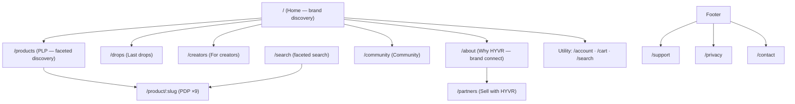

# Blueprint 1 — Information Architecture & Sitemap

The as-built IA for the HYVR reference site. Drives navigation, the `helix-sitemap.yaml`
output (`/sitemap.xml`), and the author's mental model on both surfaces (DA.live and AEMaaCS+UE).

## Site tree

## Navigation model (audience-appropriate, not executive)
| Tier | Items | Source |
|---|---|---|
| Primary (mega-menu) | Shop (by category: VR/MR, AR Glasses, Handheld, Controllers), Drops, For Creators, Why HYVR, Community | `nav.plain.html` |
| Utility | Search, Account, Cart, **theme toggle** | `nav.plain.html` + header block |
| Contextual | Breadcrumb on PLP/PDP; in-page anchors | `breadcrumb` block |
| Footer | Brand-connect (who/what/why), Shop, Connect (community/partners/support/privacy) | `footer.plain.html` |

## Templates (the `template` metadata → body class → section theming)
| Template | Used by | Notable behaviour |
|---|---|---|
| `default` | Home, brand & content pages | Auto-hero from leading H1+picture; Organization JSON-LD |
| `products` | PLP, Search | `shop` section layout (filter rail + grid) |
| `product` | PDP | Product + BreadcrumbList JSON-LD; skips auto-hero |

## Content taxonomy
- **Categories** (facets): VR/MR Headsets, AR Glasses, Handheld Gaming, Controllers, Tracking, Audio, Dev Kits, Locomotion, Input.
- **Tags**: `drop`, `new`, plus free tags — power "Last drops", "New", and search.
- **Product master data**: `/query-index.json` (generated by `helix-query.yaml` from page metadata) — the machine-readable source for PLP/PDP/comparison and AI/answer engines.

## Sitemap
- Machine: `helix-sitemap.yaml` → `/sitemap.xml` (product + editorial indices); `robots.txt` allows GPTBot/PerplexityBot/ClaudeBot (GEO/AEO).
- Human: this document + [`pages-as-built.md`](./pages-as-built.md).

## Localization (ready, not yet populated)
Locale-prefixed routing (`/de/…`), `placeholders.json` per locale, `hreflang` from the sitemap
layer. See `content-model.md` §localization. English is the launch locale.
