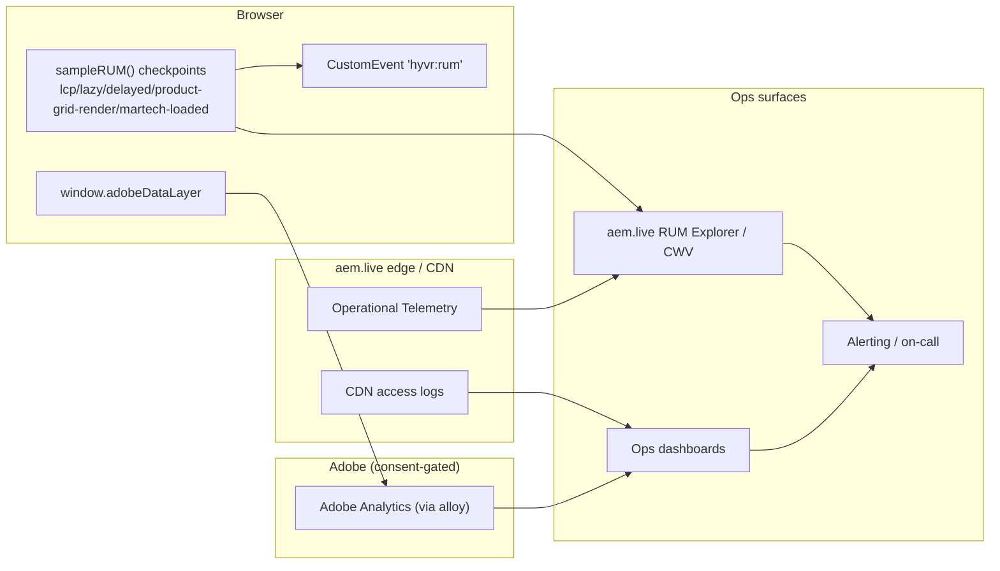

# HYVR — Observability & Operations (Blueprint 1: AEM EDS + DA.live)

> Scope: how the HYVR ("HIGH-ver") EDS reference implementation is observed, measured, alerted, and operated.
> Delivery is static-first at the aem.live edge with three-phase JS; martech is consent-gated and delayed.
> Referenced gaps: **G-BP1-3** (Tags/AEP datastream IDs), **G-BP1-5** (Playwright not vendored).

---

## 1. Observability model

HYVR relies primarily on **field (RUM) telemetry** because delivery is static and edge-cached — there is no
application server to instrument. Signals come from four sources:

- **RUM via `sampleRUM()`** (in `scripts/aem.js`; aem.live Operational Telemetry / RUM in production). It emits
  checkpoints as the three phases progress. HYVR checkpoints:
  - `lcp` — largest contentful paint captured
  - `lazy` — lazy phase entered
  - `delayed` — delayed phase entered (martech eligible)
  - `product-grid-render` — PLP grid painted (custom)
  - `martech-loaded` — alloy/Tags initialized after consent (custom)
  - plus additional custom events per block (e.g. `filter-apply`, `pdp-view`).
- **Core Web Vitals field data** — LCP / CLS / INP collected at p75 from real users.
- **aem.live operational telemetry** — availability, cache hit ratio, edge errors (Adobe-managed).
- **CDN logs** — request/status/latency at the edge (and any optional Fastly/Akamai/CloudFront tier).
- **Adobe Analytics** — business/behavioral events via alloy, only after `window.__hyvrConsent` = `in`.

---

## 2. Metrics & SLOs

| Metric | Target (SLO) | Source |
|---|---|---|
| Availability | ≥ 99.95% monthly | aem.live operational telemetry + synthetic uptime |
| LCP (p75) | < 2.0 s | RUM / CWV field data |
| CLS (p75) | < 0.1 | RUM / CWV field data |
| INP (p75) | < 200 ms | RUM / CWV field data |
| JS error rate | < 0.5% of sessions | `hyvr:rum` error events / RUM |
| Block-load failure rate | < 0.1% of block loads | RUM custom checkpoints (missing render events) |
| Martech load success (post-consent) | ≥ 99% of consented sessions | `martech-loaded` checkpoint vs consent=in |
| Edge cache hit ratio | ≥ 95% | aem.live telemetry / CDN logs |

> SLO windows are 28-day rolling. Error budget for availability ≈ 21.6 min/month at 99.95%.

---

## 3. Logging & tracing

- **Client custom events:** blocks dispatch a `hyvr:rum` `CustomEvent` on `document` carrying
  `{ checkpoint, block, t, meta }`. A thin listener forwards these into `sampleRUM()` so custom checkpoints ride
  the same RUM pipeline. This CustomEvent is the standard seam for adding new instrumentation without touching
  the loader.
- **Correlation IDs:** generate a per-page-view id (e.g. `crypto.randomUUID()`) at the eager phase, attach it to
  every `hyvr:rum` event and to the `adobeDataLayer` page context so a session can be reconstructed across RUM
  and Analytics. Never include PII in the id or its context.
- **`window.adobeDataLayer` as an observability seam:** the datalayer is both the martech feed and a structured
  event log of user/page state. Instrumentation reads/writes it (post-consent for network egress) so analytics
  and observability share one schema.
- No server-side app logs exist in Blueprint 1; edge/CDN logs are the authoritative request record.

---

## 4. Dashboards & alerting

**Charts**
- CWV panel: LCP/CLS/INP p75 trend, split by template (home / PLP / PDP) and device.
- Availability & cache-hit from telemetry + CDN logs.
- Error-rate and block-load-failure trend from `hyvr:rum`.
- Martech health: `delayed` → `martech-loaded` conversion among consented sessions.

**Thresholds & paging**

| Signal | Warn | Page (Sev) | Who |
|---|---|---|---|
| Availability < 99.95% (rolling) | 99.97% | < 99.9% → Sev1 | On-call SRE |
| LCP p75 | > 2.0 s | > 2.5 s sustained 30 min → Sev2 | On-call FE |
| INP p75 | > 200 ms | > 300 ms sustained → Sev2 | On-call FE |
| CLS p75 | > 0.1 | > 0.25 → Sev3 | FE owner (ticket) |
| JS error rate | > 0.5% | > 2% → Sev2 | On-call FE |
| Martech load success | < 99% | < 90% → Sev3 | Martech owner |

Alerts route through the paging tool to the current on-call; Sev1/Sev2 auto-open an incident channel.

---

## 5. Synthetic monitoring

- **Uptime checks** against home, `/products`, and a representative PDP (`/product/aurora-x1`) from multiple
  regions at 1-min interval → feeds availability SLO.
- **Scheduled Lighthouse** runs (daily + on release) against the same three URLs to catch lab CWV/SEO/a11y
  regressions before they show in field data. Mirrors the Lighthouse CI budgets used in `docs/cicd.md`.
- **E2E synthetic journeys** (PLP filter → PDP) are planned via Playwright but **not yet vendored (G-BP1-5)**.

---

## 6. Support & operating model

### RACI

| Activity | FE Eng | SRE/Ops | Content/Author | Martech | Adobe Support |
|---|---|---|---|---|---|
| Block/JS incident | R/A | C | I | I | C |
| Availability/edge incident | C | R/A | I | I | R |
| CWV regression | R/A | C | C | I | I |
| Content publish issue | C | I | R/A | I | C |
| Martech/consent issue | C | I | I | R/A | C |
| Dependency/CI failure | R/A | C | I | I | I |

### Severity levels

| Sev | Definition | Response | Comms |
|---|---|---|---|
| Sev1 | Site down / checkout blocked / data-privacy breach | Immediate page, all-hands | Exec + status page |
| Sev2 | Major degradation (CWV breach, high error rate, key template broken) | Page on-call, 30-min ack | Stakeholders |
| Sev3 | Partial/limited impact, workaround exists | Next business day ticket | Team |
| Sev4 | Cosmetic / low impact | Backlog | None |

### Incident response runbook (outline)
1. Detect (alert/synthetic/report) → declare severity.
2. Ack + open incident channel; assign IC.
3. Triage source: edge/CDN vs code vs content vs martech (see §7 stubs).
4. Mitigate: rollback code (`git revert` → auto-redeploy) or content (DA.live version + Sidekick unpublish/
   republish) — see `docs/cicd.md` §5.
5. Verify via RUM/synthetic; close incident.
6. Blameless postmortem within 3 business days for Sev1/Sev2.

### Escalation to Adobe support
Edge/CDN, aem.live delivery, or AEP/datastream faults that HYVR cannot mitigate escalate to **Adobe support**
with the correlation window, affected URLs, and telemetry. Track datastream/Tags identifiers under **G-BP1-3**.

---

## 7. Runbook stubs

**Block failing (render error / missing checkpoint)**
- Symptom: `product-grid-render`/block checkpoint absent; JS error spike for one block.
- Check: `hyvr:rum` errors filtered by `block`; recent PR touching that block.
- Fix: `git revert` the offending change → auto-redeploy; hotfix forward if trivial.

**Martech not loading (post-consent)**
- Symptom: `delayed` fires but `martech-loaded` does not among consented sessions.
- Check: `window.__hyvrConsent.status`, CSP `connect-src` for Adobe hosts, datastream/Tags URL (G-BP1-3),
  console/network for alloy failures.
- Fix: correct consent gate/config or CSP; if Adobe-side, escalate to Adobe support.

**CWV regression**
- Symptom: LCP/CLS/INP p75 breaches SLO in field data.
- Check: scheduled Lighthouse diff, recent content (large images — G-BP1-2) or block changes, third-party
  weight in delayed phase.
- Fix: optimize/priority-hint LCP image, reserve space to fix CLS, defer/trim delayed work; revert if release-linked.

**Content publish issue**
- Symptom: stale/incorrect page live, or publish not propagating.
- Check: DA.live version history, Sidekick preview vs live, `helix-query.yaml` index freshness.
- Fix: republish correct DA.live version via Sidekick, or unpublish/republish; re-trigger index if PLP data stale.
