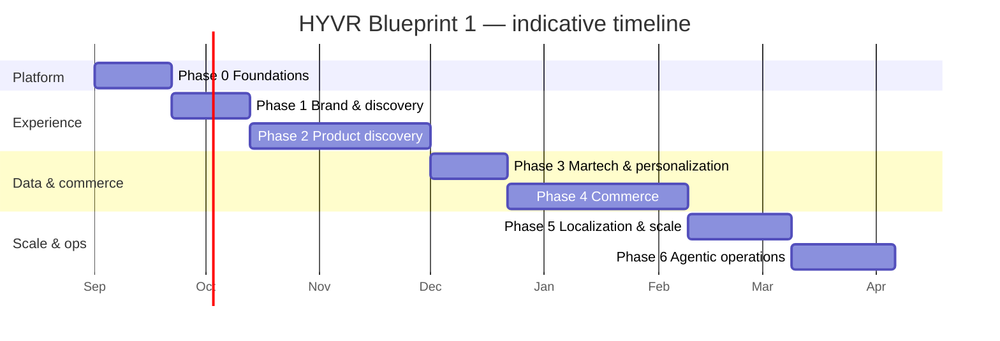

# HYVR — Implementation Roadmap & Definition of Done (Blueprint 1: AEM EDS + DA.live)

> Scope: phased delivery plan for the HYVR ("HIGH-ver") D2C AR/VR/gaming marketplace on AEM Edge Delivery
> Services (DA.live authoring, aem.live delivery, GitHub code). Effort is **relative T-shirt sizing**
> (S ≈ ~1 week, M ≈ ~2–4 weeks, L ≈ ~5–8 weeks) for a small squad (2–3 FE + 1 author + part-time martech/SRE).
> Estimates assume gaps are unblocked when their phase starts.
> Gap IDs: **G-BP1-1** provisioning, **G-BP1-2** AEM Assets, **G-BP1-3** Tags/AEP datastream IDs,
> **G-BP1-4** commerce backend, **G-BP1-5** Playwright not vendored.

---

## 1. Phases

| Phase | Goals | Key deliverables | Exit criteria | Dependencies (gaps) | Effort |
|---|---|---|---|---|---|
| **0 — Foundations** | Stand up the platform and governance | DA.live org, aem.live pipeline, GitHub repo + branch protection, design-token build from `../../design-system`, CI (`ci.yaml`) | Local→preview→live chain works; CI gates run; token-drift gate green | G-BP1-1 | M |
| **1 — Brand & discovery** | Establish brand shell and top-of-funnel pages | Home, About, global nav, hero block, community block | Pages authored in DA.live, published to live, pass Lighthouse + pa11y WCAG 2.2 AA | G-BP1-1; images G-BP1-2 | M |
| **2 — Product discovery** | Shoppable catalog browse experience | PLP, client filter, `query-index`/`helix-query.yaml`, PDP, specs block, product comparison | PLP filters on indexed data; PDP + specs + comparison render; CWV budgets met | G-BP1-2 (product imagery) | L |
| **3 — Martech & personalization** | Consent-gated measurement + targeting | Adobe Tags, AEP Web SDK (alloy), Analytics, Target, consent wiring (`window.__hyvrConsent`), datalayer schema | Martech fires only after consent=in; `martech-loaded` checkpoint tracked; Analytics/Target receiving events | G-BP1-3 | M |
| **4 — Commerce** | Cart & checkout | Cart/checkout integration to commerce backend, PDP buy flow, order confirmation | End-to-end purchase against real backend; payment delegated to PCI provider | **G-BP1-4** (blocking) | L |
| **5 — Localization & scale** | Multi-locale + performance at scale | Locale structure, translated content workflow, sitemap/hreflang, CDN/cache tuning | ≥1 additional locale live; hreflang valid; SLOs held under load | G-BP1-2, G-BP1-3 | M |
| **6 — Agentic operations** | Automate content/ops with agents | Agent-assisted authoring/QA, automated CWV/a11y watch, content-freshness + link checks | Agents run in CI/scheduled; findings triaged into backlog; guardrails documented | G-BP1-5 (E2E via Playwright) | M |

---

## 2. Timeline (indicative)

> Assumptions: phases are largely sequential but Phase 3 martech wiring can overlap the tail of Phase 2 once
> discovery pages are stable. Phase 4 is gated on the commerce backend (**G-BP1-4**); if that provisioning
> slips, Phase 5 can start early. Dates are relative to a 2026-09-01 start and are planning aids, not commitments.

---

## 3. Overall Definition of Done

A HYVR Blueprint 1 milestone is Done when:
- **Traceable to requirements:** every deliverable maps to a requirement/ticket; Req 8 (portability) evidenced
  by GitLab/Azure gate parity (see `docs/cicd.md` §4).
- **All gates green:** token-drift, ESLint, Stylelint, unit tests, Lighthouse budgets, pa11y WCAG 2.2 AA
  (blocking where enabled).
- **Docs complete:** architecture, security/privacy, observability, CI/CD, and this roadmap reflect current
  behavior.
- **Gaps owned:** each open gap (G-BP1-1…5) has a named owner and a target phase; none silently unaddressed.
- **Field-verified:** SLOs in `docs/observability.md` met on live for the shipped scope.
- **Rollback ready:** code (`git revert`) and content (DA.live version + Sidekick) rollback paths confirmed.

---

## 4. RACI — build vs run

| Function | Build (project delivery) | Run (steady state) |
|---|---|---|
| Front-end engineering | **R/A** blocks, JS phases, CWV | **R** fixes, CWV regressions |
| Content authoring (DA.live) | **C** templates | **R/A** content publish |
| Martech | **C** datalayer/consent design | **R/A** tags/analytics/target health |
| SRE/Ops | **C** pipeline, CDN | **R/A** availability, edge, incidents |
| Security/Privacy | **C** CSP, consent, tokens | **A** compliance posture, reviews |
| Product owner | **A** scope/priorities | **A** roadmap, gap ownership |
| Adobe support | **I** | **C** escalations (edge/AEP) |

(R = Responsible, A = Accountable, C = Consulted, I = Informed.)

---

### Gap ownership summary

| Gap | Description | First blocked phase | Suggested owner |
|---|---|---|---|
| G-BP1-1 | DA.live/aem.live provisioning | 0 | SRE/Ops + PO |
| G-BP1-2 | AEM Assets | 1–2 | Content + FE |
| G-BP1-3 | Tags/AEP datastream IDs | 3 | Martech |
| G-BP1-4 | Commerce/cart/checkout backend | 4 | PO + backend/commerce |
| G-BP1-5 | Playwright not vendored | 6 (E2E) | FE/QA |
