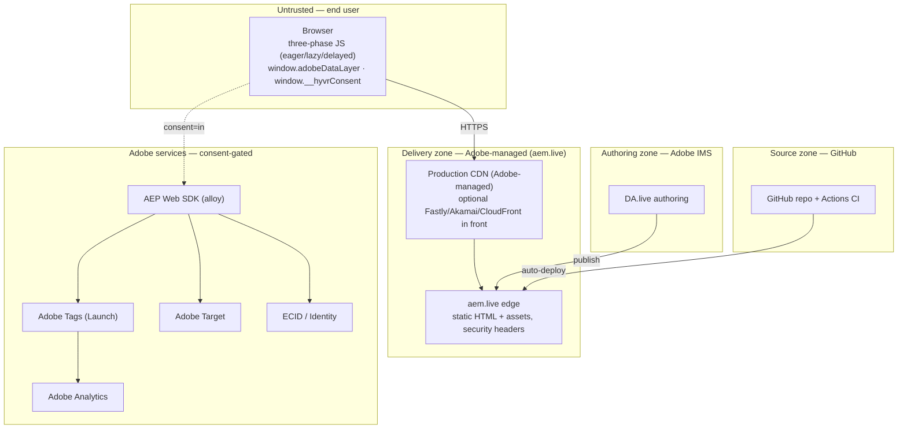

# HYVR — Security & Privacy (Blueprint 1: AEM Edge Delivery Services + DA.live)

> Scope: the HYVR ("HIGH-ver") D2C AR/VR/gaming marketplace reference implementation built on AEM
> Edge Delivery Services (EDS) with DA.live authoring, aem.live delivery, and git-based code in GitHub.
> This document describes security controls and privacy posture. It is a **readiness** reference, not legal
> advice. Referenced gaps: **G-BP1-1** (DA.live/aem.live provisioning), **G-BP1-2** (AEM Assets),
> **G-BP1-3** (Tags/AEP datastream IDs), **G-BP1-4** (commerce backend), **G-BP1-5** (Playwright not vendored).

---

## 1. Trust zones & threat model

HYVR is **static-first**: HTML is rendered/cached at the edge and hydrated by three-phase JavaScript
(eager → lazy → delayed). Martech is **consent-gated and delayed**. The security surface therefore spans
five zones with distinct owners and trust levels.



**Trust boundaries** (dashed) sit between: browser↔edge (public internet), browser↔Adobe services
(only crossed after consent), authoring↔delivery (IMS-authenticated publish), and source↔delivery
(GitHub auto-deploy).

### Threat model (STRIDE-lite, prioritized)

| Threat | Vector | Primary control |
|---|---|---|
| Supply-chain compromise | Malicious/typosquatted npm dep, unpinned transitive dep | Pinned deps, `npm audit`, Dependabot, CI (§2) |
| Third-party script injection | Compromised martech/CDN endpoint | Strict CSP allowlist, SRI where feasible (§2) |
| XSS via authored content | Author or injected markup reaches DOM | EDS block sanitization, CSP, DA.live authenticated authoring |
| Consent bypass / silent tracking | Martech firing before `consent=in` | `window.__hyvrConsent` gate, delayed phase only (§3) |
| Credential/token theft | Leaked deploy token, unprotected branch | Branch protection, least-privilege tokens, signed commits (§5) |
| PII leakage | PII in URLs, logs, or datalayer | Data minimization, no PII in URLs (§3, §6) |
| Clickjacking | Framing of HYVR pages | `frame-ancestors`, `X-Frame-Options` (§2) |

---

## 2. Security controls

### 2.1 HTTP security headers

Set at the **edge/CDN layer** (aem.live response config, and mirrored on any optional Fastly/Akamai/CloudFront
tier in front — see Env chain). Because EDS serves static HTML from the edge, headers are configured in
delivery config rather than emitted per-request by application code.

| Header | Value (recommended) | Purpose |
|---|---|---|
| `Strict-Transport-Security` | `max-age=63072000; includeSubDomains; preload` | Force HTTPS, 2-year HSTS |
| `X-Content-Type-Options` | `nosniff` | Block MIME sniffing |
| `Referrer-Policy` | `strict-origin-when-cross-origin` | Limit referrer leakage |
| `X-Frame-Options` | `SAMEORIGIN` | Anti-clickjacking (legacy backstop to CSP) |
| `Permissions-Policy` | `camera=(self), microphone=(), geolocation=(), payment=(self), interest-cohort=()` | AR/VR needs camera on-site; deny the rest by default |
| `Content-Security-Policy` | see §2.2 | Restrict script/style/connect origins |

> AR/VR note: HYVR product demos may use `getUserMedia` (camera). `Permissions-Policy` therefore allows
> `camera=(self)` but denies microphone/geolocation unless a specific block requires them.

### 2.2 Content-Security-Policy for EDS + Adobe

A concrete starting CSP that permits EDS delivery plus the Adobe martech stack (alloy/Tags/Analytics/Target).
The exact datastream/Tags hostnames depend on provisioning (**G-BP1-3**) — treat the Adobe hosts below as the
allowlist to confirm against your tenant.

```
Content-Security-Policy:
  default-src 'self';
  script-src 'self' https://*.aem.live https://*.aem.page https://assets.adobedtm.com https://*.adobe.com;
  style-src 'self' 'unsafe-inline' https://*.aem.live;
  img-src 'self' data: https://*.aem.live https://*.adobe.com https://*.demdex.net;
  font-src 'self' https://*.aem.live;
  connect-src 'self' https://*.aem.live https://edge.adobedc.net https://*.sc.omtrdc.net https://*.tt.omtrdc.net https://*.demdex.net;
  frame-src 'self';
  frame-ancestors 'self';
  base-uri 'self';
  form-action 'self';
  object-src 'none';
  upgrade-insecure-requests
```

Notes:
- `edge.adobedc.net` is the AEP Edge Network (alloy) datastream endpoint; `*.sc.omtrdc.net` = Analytics,
  `*.tt.omtrdc.net` = Target, `*.demdex.net` = ECID/identity.
- `assets.adobedtm.com` is the Adobe Tags (Launch) library host.
- `'unsafe-inline'` in `style-src` is a pragmatic allowance for EDS/authored inline styles; keep it out of
  `script-src`. Prefer nonces if the edge tier supports them.
- Ship **Content-Security-Policy-Report-Only** first, collect violations, then enforce. Add a `report-to`/
  `report-uri` endpoint during rollout.

### 2.3 Subresource & supply-chain

- **Subresource Integrity (SRI):** apply `integrity` hashes to any statically referenced third-party script
  where the vendor publishes a stable, hashed URL. The Tags/alloy loaders are versioned and typically not
  SRI-pinnable, so they are constrained by CSP allowlist + delayed-phase loading instead.
- **Pinned dependencies:** `package.json` / lockfile pin exact versions; CI runs `npm ci` (lockfile-faithful).
- **`npm audit`** in CI to flag known-vuln deps; fail on high/critical for production releases.
- **Dependabot** for automated dependency and GitHub Actions updates, reviewed via PR (subject to the same
  CI gates in `docs/cicd.md`).

---

## 3. Privacy & consent

### 3.1 Consent-gated martech

No martech network call fires until consent is granted. The three-phase loader keeps all Adobe tags in the
**delayed** phase, and the delayed phase reads consent before initializing alloy/Tags.

```mermaid
sequenceDiagram
    participant U as User
    participant P as Page (delayed phase)
    participant C as window.__hyvrConsent (CMP)
    participant A as Adobe (alloy/Tags/AA/Target/ECID)
    U->>P: page load (eager/lazy render, no tracking)
    P->>C: read consent state
    alt consent = in
        P->>A: init alloy, send events
    else consent = pending / out
        P-->>P: hold; queue nothing to network
    end
    U->>C: grants/denies via CMP (Adobe/OneTrust)
    C-->>P: consent change event → (re)evaluate
```

### 3.2 `window.__hyvrConsent` shape

```js
window.__hyvrConsent = {
  status: 'pending',        // 'pending' | 'in' | 'out'  — default 'pending'
  categories: {
    necessary: true,        // always true
    analytics: false,       // Adobe Analytics
    personalization: false, // Adobe Target
    marketing: false,       // advertising/marketing tags
  },
  source: 'adobe-cmp',      // 'adobe-cmp' | 'onetrust'
  updatedAt: '2026-09-01T00:00:00Z',
};
```

- **Default is `pending → in`**: martech stays off in `pending` and only activates when the CMP resolves to
  `in`. Denied categories remain off even after resolution.
- Consent is sourced from the **Adobe / OneTrust CMP** and normalized onto `window.__hyvrConsent`.

### 3.3 Data minimization & PII

- **No PII in URLs / query strings** — never place email, name, address, or identifiers in the address bar.
- Send only the minimum event attributes needed for analytics/personalization to `window.adobeDataLayer`.
- Do not log PII to client `console` or to CDN access logs.

### 3.4 Right to be forgotten

Deletion/erasure requests are fulfilled via **AEP** privacy tooling (Privacy Service / consent APIs) keyed on
ECID. HYVR's app code holds no independent customer datastore in Blueprint 1 (commerce backend is **G-BP1-4**),
so erasure flows through Adobe. Document the AEP data-subject-request runbook once datastreams are provisioned
(**G-BP1-3**).

---

## 4. Identity

- **ECID / FPID:** Adobe ECID is the visitor identifier, established by alloy only after consent. Prefer the
  **FPID (first-party device ID)** cookie posture so the identity cookie is set in the HYVR first-party domain
  context rather than a third-party context.
- **First-party cookie posture:** run alloy in first-party mode; where a CDN tier fronts delivery, ensure the
  identity cookie domain matches the HYVR apex so cookies survive ITP/third-party restrictions.
- No identity cookie is written while `status` is `pending`/`out`.

---

## 5. Authentication & authorization

### 5.1 Authoring (DA.live / IMS)

- Authors authenticate via **Adobe IMS** against the HYVR Adobe org (provisioning tracked in **G-BP1-1**).
- Role model (least privilege): **Author** (edit/preview), **Publisher** (publish to live), **Admin**
  (site config, membership). Sidekick actions inherit the signed-in IMS user's role.
- Review/publish separation: authors preview; only Publisher/Admin publish to `*.aem.live`.

### 5.2 Code (GitHub)

- **Branch protection** on `main`: required PR, required status checks (all CI gates in `docs/cicd.md`),
  no direct pushes, no force-push.
- **Signed commits** (GPG/SSH signing) required; enforce "require signed commits" on protected branches.
- **Least-privilege deploy tokens:** the aem.live code-sync uses a scoped GitHub App / token limited to the
  repo; no org-wide or write-all PATs. CI secrets are scoped per environment (see `docs/cicd.md` §6 and
  **G-BP1-3** for datastream/Tags IDs).

---

## 6. Data classification & handling

| Class | Examples | Handling |
|---|---|---|
| Public | Product pages, marketing copy, images | Served static at edge; cacheable |
| Internal | Query-index, block config, tokens source | In GitHub; not sensitive but access-controlled |
| Confidential | Deploy tokens, datastream IDs, CI secrets | Secret stores only; never committed; masked in logs |
| Personal (PII) | ECID/FPID, consent state, any future customer/order data | Consent-gated, minimized, no PII in URLs/logs; erasure via AEP |
| Restricted | Payment/card data (future commerce, G-BP1-4) | **Never** handled by HYVR front-end; delegate to PCI-compliant provider |

---

## 7. Compliance posture (readiness — not legal advice)

- **GDPR readiness:** lawful-basis via CMP consent (`pending→in`), data minimization, right-to-erasure via
  AEP, first-party identity, EU data residency to be confirmed at datastream setup (**G-BP1-3**).
- **CCPA/CPRA readiness:** honor opt-out (`status='out'` disables analytics/marketing categories), "Do Not
  Sell/Share" mapped to the marketing category, Global Privacy Control (GPC) signal respected by the CMP.
- Cookie/consent banner defaults to the most privacy-preserving state (non-essential off) until the user acts.
- These are engineering readiness statements; HYVR legal/DPO must validate the actual policy, records of
  processing, and DPA coverage with Adobe.

---

### Open gaps referenced

| Gap | Impact on this doc |
|---|---|
| G-BP1-1 | Finalize IMS org, roles, DA.live/aem.live provisioning (§5.1) |
| G-BP1-2 | AEM Assets governance and asset CSP `img-src` origins (§2.2) |
| G-BP1-3 | Confirm datastream/Tags hostnames in CSP; AEP erasure runbook (§2.2, §3.4) |
| G-BP1-4 | Commerce backend introduces payment/order PII → Restricted class (§6) |
| G-BP1-5 | Playwright not vendored → security regression E2E deferred |
