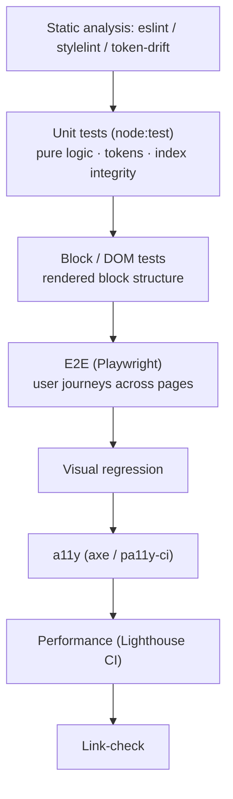

# HYVR Test Strategy & Automated Quality Gates

**Blueprint 1 — AEM Edge Delivery Services (EDS) + DA.live** · Covers Req 5.

This document defines how the HYVR reference implementation is tested, which gates run where, and the current sample results. HYVR (pronounced "HIGH-ver") is a document-authored (DA.live), edge-delivered (aem.live) storefront built from 17 vanilla-JS blocks with governed design tokens.

---

## 1. Test pyramid for EDS



- **Unit (node:test).** Pure logic, design-token integrity, and `/query-index.json` integrity — fast, no browser. This is the widest, fastest layer.
- **Block / DOM tests.** Assert that each block decorates into the expected DOM (sections, counts, structure) against the local server.
- **E2E (Playwright).** Cross-page user journeys (home → PLP filter → PDP), against the aem.live preview.
- **Visual regression.** Screenshot diffs of key pages/blocks to catch unintended styling changes.
- **a11y (axe / pa11y-ci).** WCAG 2.2 AA — automated violations gate.
- **Performance (Lighthouse CI).** CWV and category scores.
- **Link-check.** No broken internal/external links.
- **Token-drift gate.** `styles/tokens.css` must match the generated source from `../../design-system`; any local edit fails the gate.

---

## 2. What runs where

| Stage | Runs | Purpose |
|---|---|---|
| **Pre-commit hooks** | eslint, stylelint, token-drift check, unit tests | Fast local feedback; block obviously broken commits |
| **PR CI** (`.github/workflows/ci.yaml`) | eslint, stylelint, token-drift, unit tests, Lighthouse CI, pa11y-ci, Playwright e2e | Full gate before merge |
| **Pre-publish** | Lighthouse CI + pa11y-ci against the aem.live **preview** | Verify the exact artefact to be published |
| **Post-publish synthetic** | Uptime + CWV + smoke monitoring (ops) | Production health (pending **G-BP1-1**) |

---

## 3. Current sample results

### Unit tests — `npm test` (node:test)

```
$ node --test test/tokens.test.mjs test/content.test.mjs
ok 1 - product index has data
ok 2 - every product has required machine-readable fields
ok 3 - availability values are valid schema.org states
ok 4 - prices are numeric strings
ok 5 - paths are unique
ok 6 - tokens.css exists and has HYVR custom properties
ok 7 - semantic aliases are fully resolved (no leftover DTCG {refs})
ok 8 - brand primary resolves to the volt hex
ok 9 - dark-first background resolves to voidblack
# tests 9
# pass 9
# fail 0
```

Assertions in plain language: the product index has data; every product carries the required machine-readable fields; availability values are valid schema.org states; prices are numeric strings; paths are unique; `tokens.css` has `--hyvr-*` custom properties; semantic aliases are fully resolved (no leftover DTCG `{refs}`); brand primary resolves to `#00E5A8`; dark-first background resolves to `#0A0A0F`.

### Live DOM verification

Verified in-browser against the local server (`node tools/server.mjs`):

| Page | Check | Result |
|---|---|---|
| `/` (home) | 6 sections all `loaded`; featured grid renders **4 product cards** from `/query-index.json` | ✅ |
| `/products` (PLP) | Filter form + **9 cards** + **10 category chips**; **live filter**: search + category + availability all update the grid and count | ✅ |
| `/product/aurora-x1` (PDP) | Price **$1,299**; **15 spec rows**; **4 gallery** thumbs; **comparison 4×8**; `Product` + `BreadcrumbList` JSON-LD emitted | ✅ |
| `/about` (brand) | Sections loaded; `Organization` JSON-LD emitted | ✅ |

---

## 4. Quality gates

| Gate | Tool | Threshold |
|---|---|---|
| Token drift | `git diff --exit-code styles/tokens.css` | Must match generated source (0 diff) |
| JS lint | eslint | 0 errors |
| CSS lint | stylelint | 0 errors |
| Performance / SEO / best-practices | Lighthouse CI | `lighthouse:recommended` |
| Accessibility | pa11y-ci / axe | WCAG 2.2 AA — 0 violations |
| E2E smoke | Playwright (`test/e2e.spec.mjs`) | All pass |

> Lighthouse CI and pa11y-ci run in CI **against the aem.live preview**. Playwright e2e requires `@playwright/test`, which is **not yet vendored** — tracked as gap **G-BP1-5**. The node unit tests and live DOM checks above are reproducible now.

---

## 5. Definition of Done (block / feature)

A block or feature is Done when:

1. **Renders** correctly from a DA.live document across all four breakpoints (600 / 900 / 1200 / 1600).
2. **Uses governed tokens only** — no local hex/spacing; token-drift gate passes.
3. **Unit-tested** where pure logic exists (parsing, formatting, index consumption).
4. **DOM-verified** — expected sections/elements/counts assert green.
5. **Accessible** — pa11y-ci WCAG 2.2 AA 0 violations; keyboard-operable; focus visible; `prefers-reduced-motion` honoured.
6. **Performant** — no CWV/Lighthouse regression (perf ≥ 95).
7. **Lint-clean** — eslint 0, stylelint 0.
8. **Structured/semantic** — emits correct metadata and, where applicable, JSON-LD.
9. **e2e covered** — journey step added to `test/e2e.spec.mjs` when user-facing.
10. **Documented** — authoring model reflected in `/models` (definition/models/filters) as needed.

---

## 6. Test data management

- The canonical fixture is **`/query-index.json`** — a committed, deterministic stand-in for the index that aem.live generates from `helix-query.yaml`. It backs unit tests (integrity), DOM tests (grid/filter/comparison counts), and e2e (journeys).
- Fixture invariants enforced by unit tests: has data; required machine-readable fields present; valid schema.org `availability`; numeric `price` strings; unique `path`s. Changing the fixture that breaks an invariant fails the unit gate.
- Keep the fixture in sync with the product documents under `/product/**`; when live commerce data lands (**G-BP1-4**), the fixture becomes the offline test double while production reads the generated index.
- Placeholder/localized strings are fixtured via `placeholders.json` so copy changes don't destabilise tests.
